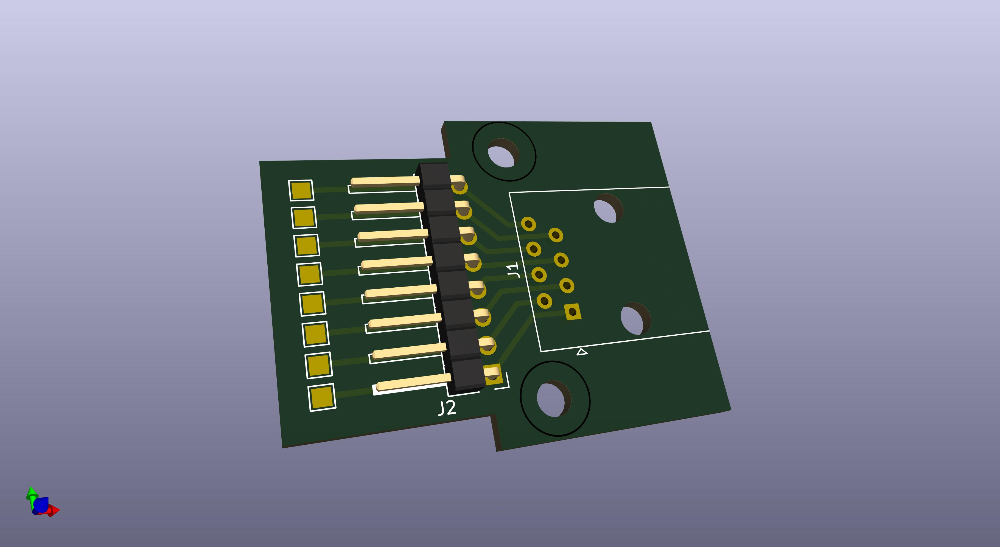
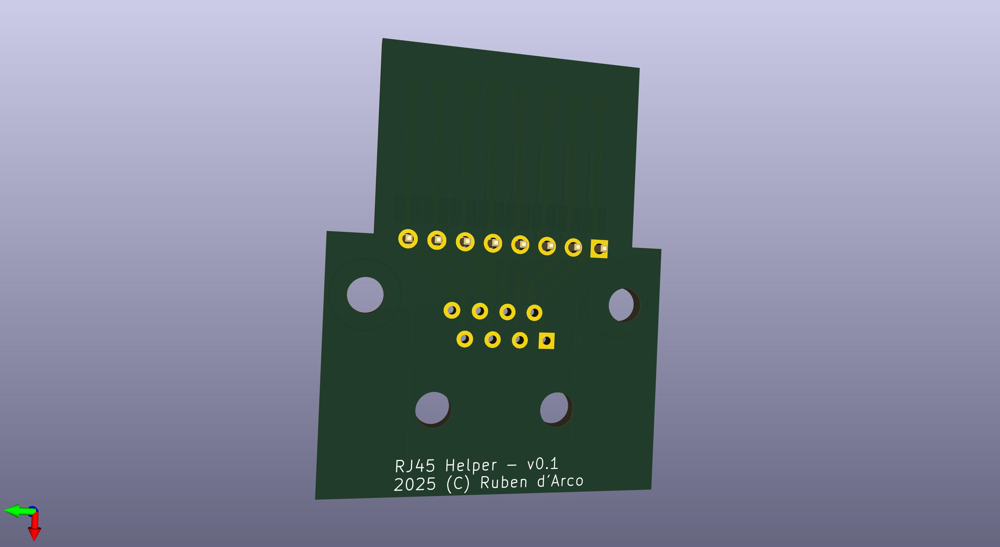

# RJ45 Breakout

Very simple KiCaD project for a board that has a RJ45 connector on it, and some header pins to connect wires too.

## Why?

I have a bunch of these RJ45 connectors that i bought one day. Now, i'm trying to use RJ45 to have sensors on a wire. To be able to develop and test these things, it's useful to just be able to go to DuPont wires. This board allows you to do that.

## Pictures

### Front

### Back

